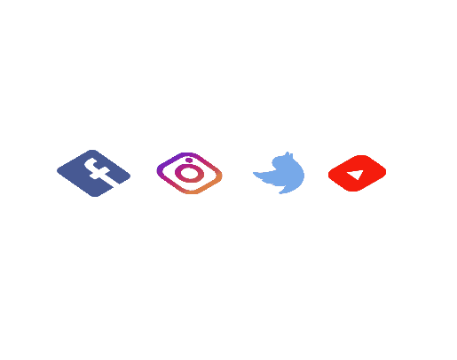

# 30diasDeCSS :rocket:

Fala ai, tudo certo ?

Me rendi ao desafio CSS em 30 dias criado pela [Milena Carecho](https://github.com/MilenaCarecho/30diasDeCSS), que consite em cada dia do mês desenvolver um projetinho diferente focando em CSS, postar no github e nas redes sociais. Cada dia será um desafio diferente e dessa forma é possível treinar os vários recursos de CSS. :v:

# Desafios 

## <li> Dia 01 - Ícone de mídia social em camadas

### O que aprendi com esse desafio ?

<li> Propriedades de transform como: skew, rotate e scale
<li> Transições
<li> nth-child()

---

## <li> Dia 02 - Loader animado

  Em execução ...